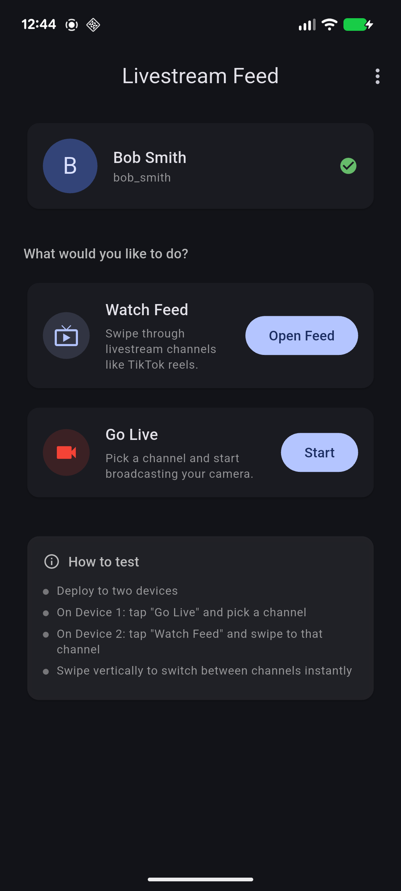
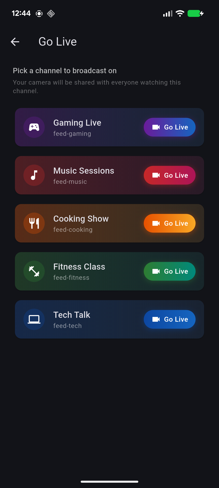

# Livestream Feed Example

A showcase app demonstrating a **TikTok-style vertical livestream feed** using the [Stream Video Flutter SDK](https://pub.dev/packages/stream_video_flutter).

> [!IMPORTANT]
> The predefined API key, user credentials, and channel IDs in this sample should be treated as publicly accessible demo values. If you reuse them, other people running the sample may join the same livestream channels.

## Screenshots & Demo

| Feed (viewer) | Host (go live) |
|---------------|----------------|
|  |  |

**Feed scrolling demo:**


## Use Case

Users browse a vertical feed of livestream channels by swiping up/down. Each swipe leaves the current livestream and joins the next one. A debounced call-switching manager handles rapid swiping gracefully, queuing only the latest channel and skipping intermediate ones.

This pattern is common in:

- **Short-form live video apps** — TikTok Live, Instagram Live, YouTube Shorts Live
- **Live shopping platforms** — browse vendor livestreams
- **Live event apps** — switch between stage cameras or breakout sessions

## How It Works

### Viewer (Feed)

1. **Pick a user** — Two predefined test users (Alice & Bob)
2. **Open the feed** — A full-screen vertical `PageView` of 5 channels
3. **Swipe to switch** — Each swipe triggers the `CallManager` to leave the current livestream and join the next
4. **See live video** — When a host is broadcasting, the viewer sees their camera full-screen with a LIVE badge and viewer count

### Host (Go Live)

1. **Pick a channel** — Select from 5 predefined channels
2. **Go live** — Camera and microphone are enabled, the livestream starts
3. **Broadcast** — Other users in the feed will see the host's video on that channel

### Key SDK Pattern — Call Switching Manager

```dart
class CallManager extends ChangeNotifier {
  Call? _currentCall;
  String? _nextCallId;

  void switchToCall(String callId) {
    _nextCallId = callId;
    if (_state != CallManagerState.connecting) _triggerCallSwitch();
  }

  Future<void> _triggerCallSwitch() async {
    _state = CallManagerState.connecting;
    await _currentCall?.leave();

    final nextCall = StreamVideo.instance.makeCall(
      callType: StreamCallType.liveStream(),
      id: _nextCallId!,
    );
    _currentCall = nextCall;
    _nextCallId = null;

    await nextCall.getOrCreate();
    await nextCall.join(connectOptions: CallConnectOptions(
      camera: TrackOption.disabled(),
      microphone: TrackOption.disabled(),
    ));

    // If another switch was queued during connection, process it immediately
    if (_nextCallId != null) {
      _triggerCallSwitch();
    } else {
      _state = CallManagerState.connected;
      notifyListeners();
    }
  }
}
```

## Running the App

1. Open the project in your IDE
2. Run `flutter pub get`
3. Deploy to **two devices** (physical devices or emulators)
4. **Device 1**: Log in as Alice, tap "Go Live", pick a channel (e.g., "Gaming Live")
5. **Device 2**: Log in as Bob, tap "Watch Feed", swipe to the same channel
6. Bob sees Alice's live video; swipe up/down to switch channels

## Configuration

To use your own Stream credentials, update `lib/app_config.dart`:

- Replace `streamApiKey` with your Stream API key
- Generate new user tokens at https://getstream.io/chat/docs/flutter-dart/tokens_and_authentication/#manually-generating-tokens
- Update user IDs and tokens

## Dependencies

- `stream_video_flutter: ^1.2.4` — Video calling SDK with pre-built UI
- `permission_handler: ^12.0.1` — Runtime camera/microphone permissions
